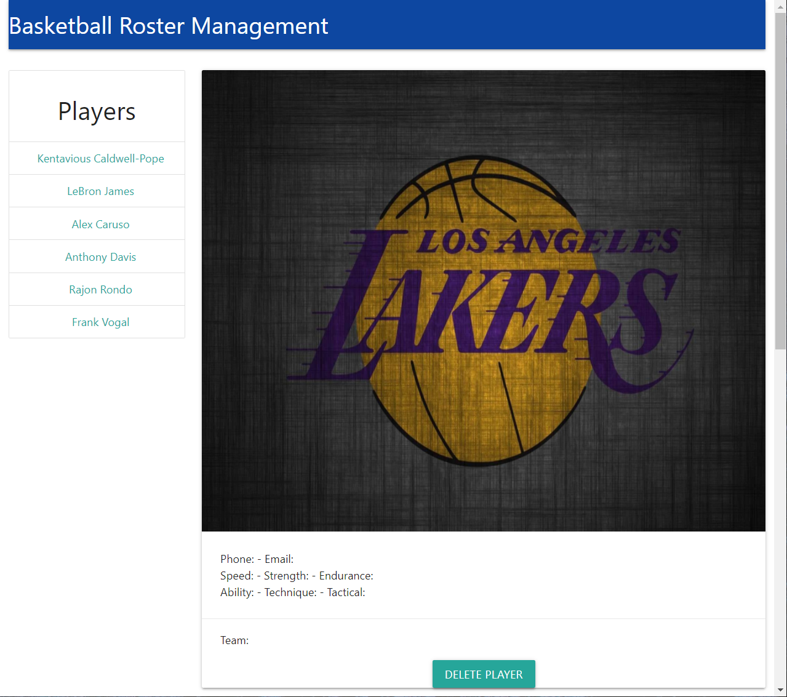
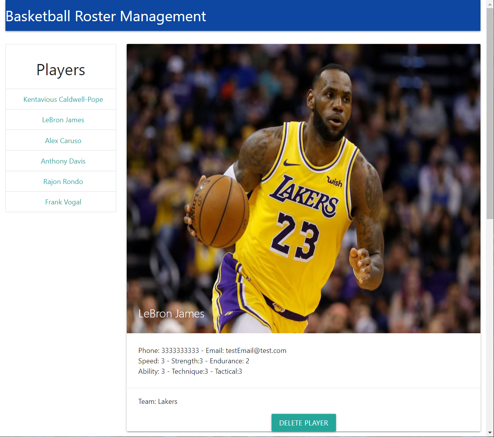
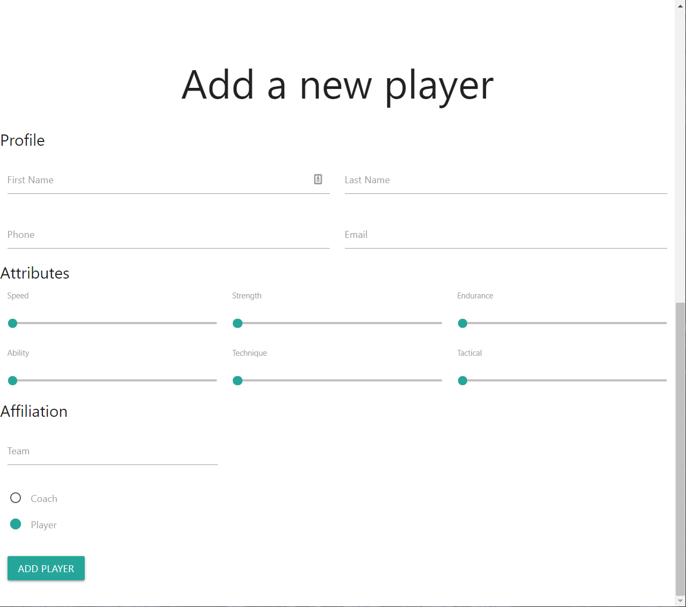

# Basketball Roster Application

A team roster management application that can be used to keep track of players and coaches on the team. This example is for a basketball team but the application can be adapted for any other sport.

### Features

- Full stack web application using NodeJS, Express, React, and MongoDB
- Other libraries used include Mongoose and Axios

### Images

**Main Screen**: 

  
**Player Profile**: 

  
**New Player Form**: 

  
